<div align="center">

<picture>
  
</picture>

<h1>GameIndex</h1>

<p><strong>A unified, cross-store game launcher and library manager.</strong></p>

Unify your Steam, GOG, Epic, Rockstar, Ubisoft, and DRM-free libraries into a single, fast, native experience — with discovery, sync, activity tracking, a social layer, and a controller-first Big Picture mode.

<br />

[](#status)
[](#platforms)
[](#tech-stack)
[](#license)

</div>

---

## 📑 Table of Contents

- [✨ Features](#-features)
- [📸 Screenshots](#-screenshots)
- [💡 Inspiration](#-inspiration)
- [🛠️ Tech Stack](#️-tech-stack)
- [🚀 Getting Started](#-getting-started)
- [📁 Project Structure](#-project-structure)
- [🗺️ Roadmap](#️-roadmap)
- [📌 Status](#-status)
- [🤝 Contributing](#-contributing)
- [📄 License](#-license)
- [🙏 Acknowledgments](#-acknowledgments)

---

## ✨ Features

| Feature | Description |
|---------|-------------|
| **Unified Library** | Steam, GOG Galaxy, Epic Games Store, Rockstar, Ubisoft Connect, Humble Bundle, and manual imports in one cohesive grid. |
| **Rich Game Pages** | Hero, metadata, reviews, achievements, screenshots, videos, web links, HowLongToBeat, Crackwatch, ProtonDB, and live player counts. |
| **Hydra-powered Storefront** | Browse the Hydra community catalogue with featured rails, search, filters, price badges, comparisons, and wishlist tracking. |
| **Community Reviews & Stats** | Read Hydra user reviews (replies, votes, sorting) and surface community player/download counts and star scores per game. |
| **Activity Tracking** | FPS, frametime, and per-session metrics via MSI Afterburner / RTSS, with interactive timeline, Gantt, performance, and sparkline views. |
| **Downloads** | Direct downloads, debrid (Real-Debrid / AllDebrid), and torrents via `librqbit`. |
| **Storage Manager** | Visualize disk usage, move installs between drives, and bulk-recalculate sizes. |
| **Community & Friends** | Local-first social layer: profiles, friend sync, shared recommendations, and a community feed. |
| **Big Picture Mode** | Controller-friendly, full-screen launcher UI for couch and TV play — Friends, Community, News, and more, all gamepad-navigable. |
| **Live Player Counts** | Combined Steam + Hydra counts with a tabbed popover and a historical player-count graph with range toggle. |
| **Theming & Density** | Dark-first design with light mode, a theme gallery (aurora, cyberpunk, catppuccin, tokyonight, …), compact/comfortable layouts, and a custom accent picker. |

> 🚧 **Planned / in progress:** Discord Rich Presence (event hook wired, IPC plugin pending) · Linux + Steam Deck support.

---

## 📸 Screenshots

<p align="center"><sub>Dark-first UI, captured on Windows. Layout adapts to light mode and the controller-friendly Big Picture mode.</sub></p>

### 🏠 Main Page / Library

<p>
  
  
</p>

### 🛒 Store

<p>
  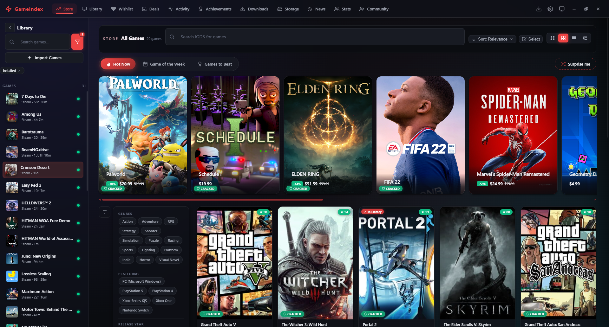
  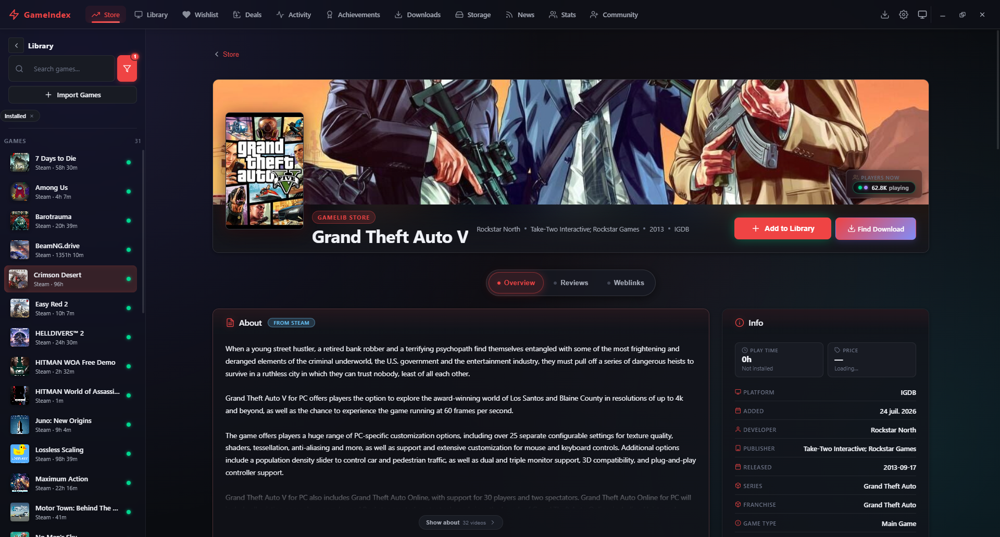
</p>

### 📰 News

<p>
  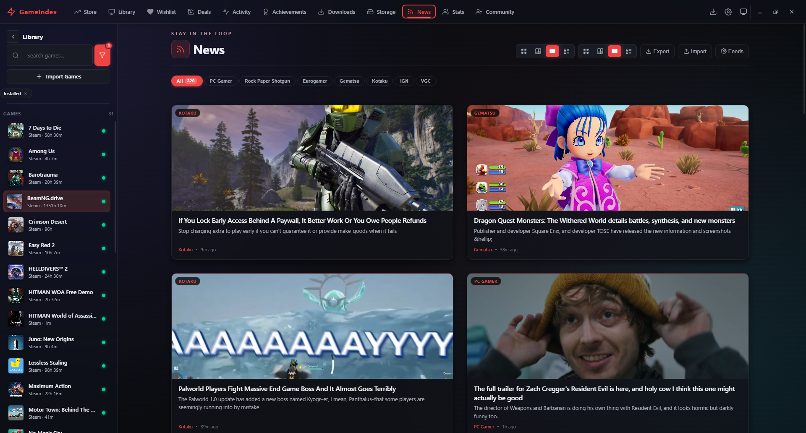
  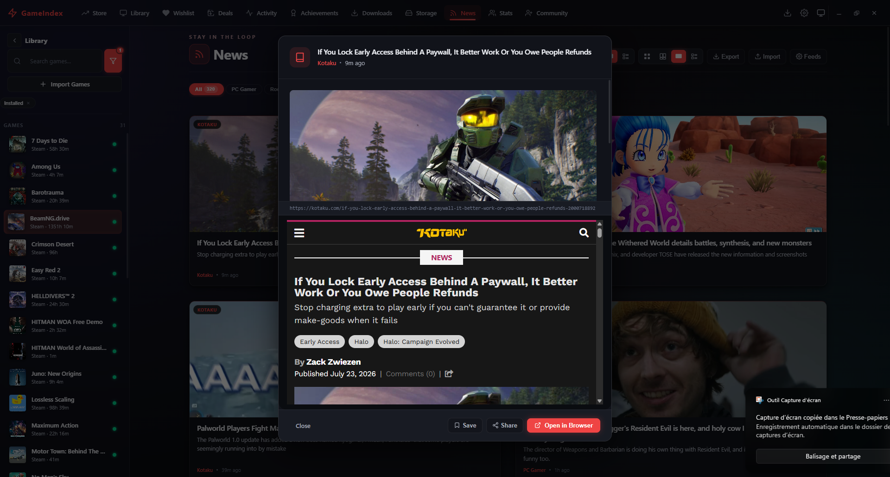
</p>

### 💰 Deals

<p>
  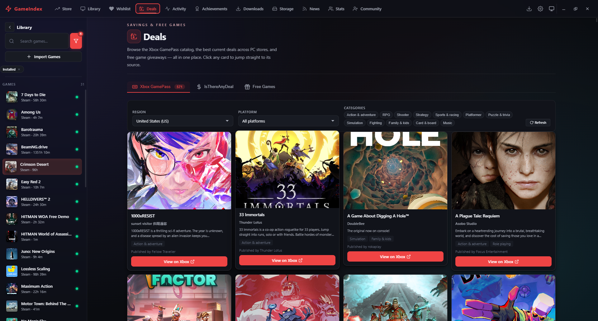
  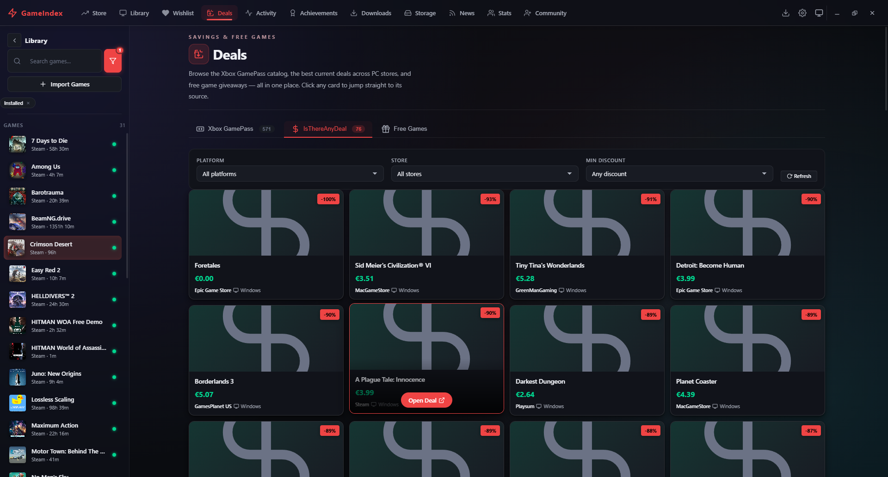
  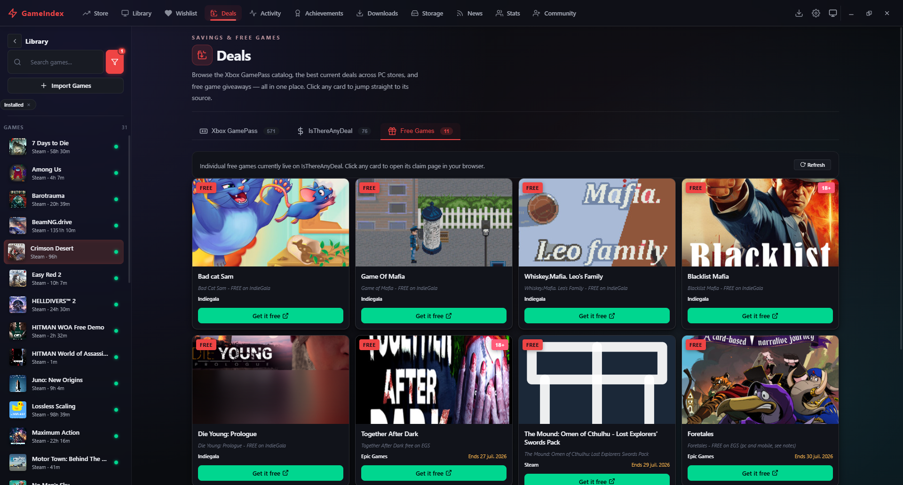
</p>

### 📥 Downloads

<p>
  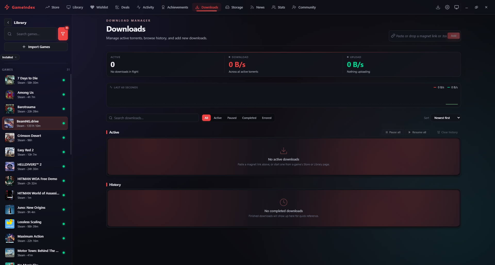
</p>

### 💾 Storage

<p>
  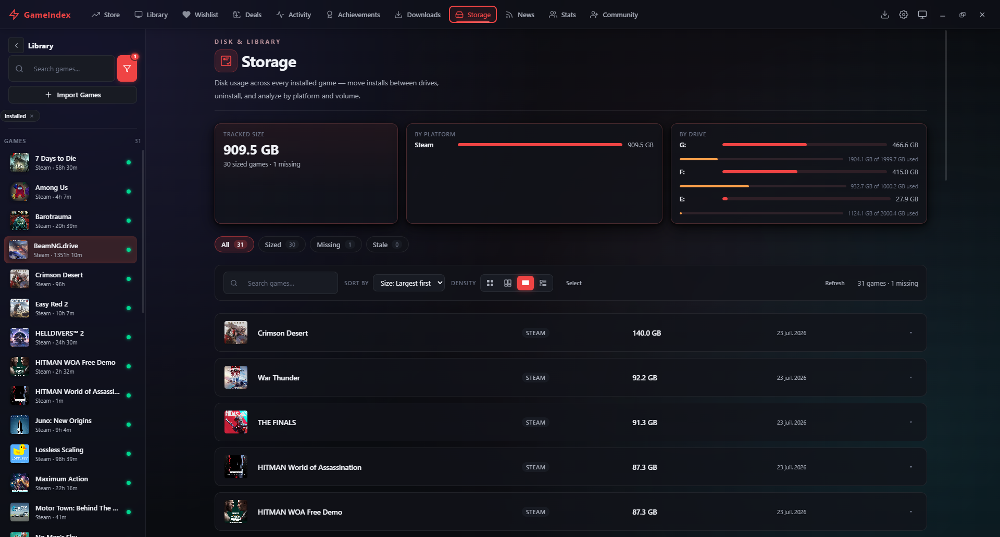
  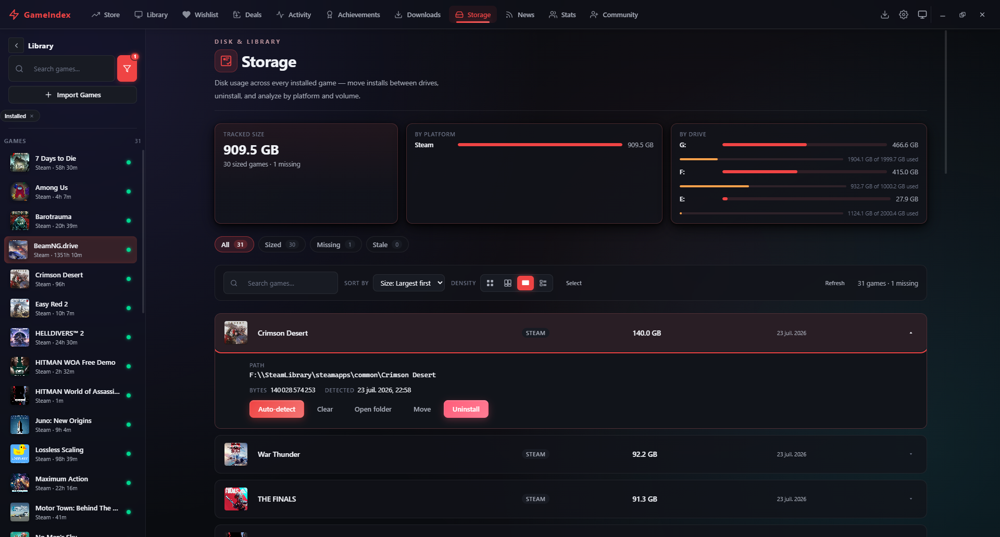
</p>

### 🏆 Achievements

<p>
  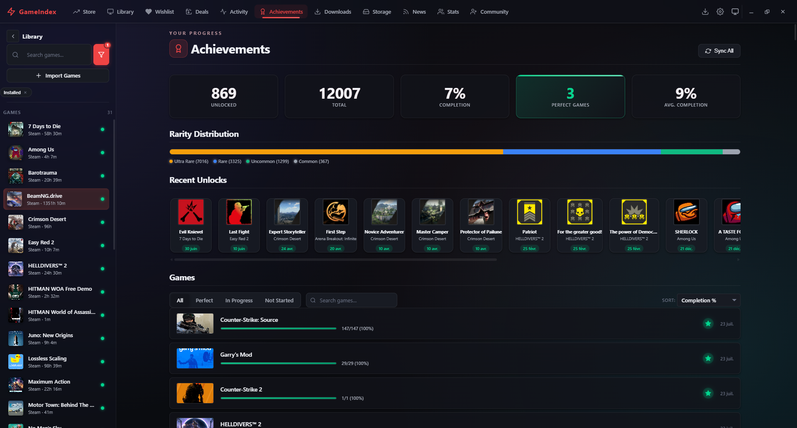
</p>

### 💜 Wishlist

<p>
  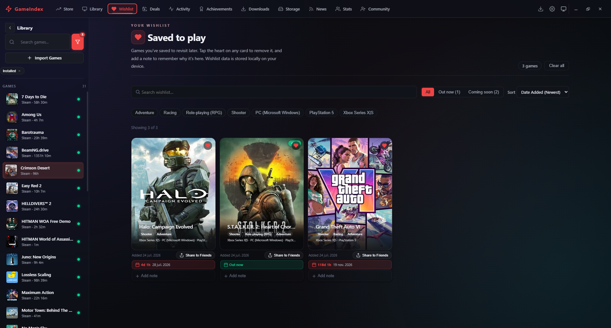
</p>

> 📷 More pages (Activity, Friends, Community, Big Picture) coming soon.

---

## 💡 Inspiration

GameIndex is built *with* — not just inspired by — excellent projects in the launcher space:

- **[Hydra Launcher](https://hydralauncher.gg)** — the clean, modern, torrent-first approach to game distribution. GameIndex integrates Hydra's public APIs for its store catalogue, community reviews, and community stats.
- **[Playnite](https://playnite.com)** — the extensible, library-aggregation philosophy and customization depth.
- **[LaunchBox](https://www.launchbox-app.com)** — rich metadata, media, and emulation-focused cataloging.
- **[Steam](https://store.steampowered.com)** + **[GOG Galaxy](https://www.gog.com/galaxy)** — unified-library UX patterns.

We borrow the best ideas from each and aim to combine them into a single, lightweight native app.

---

## 🛠️ Tech Stack

| Layer    | Technology |
|----------|------------|
| Shell    | [Tauri v2](https://tauri.app) (Rust) |
| Frontend | [React 19](https://react.dev) + [TypeScript](https://www.typescriptlang.org) |
| Bundler  | [Vite 7](https://vitejs.dev) |
| DB       | SQLite (`rusqlite` + `r2d2_sqlite`) |
| Secrets  | OS keychain via [`keyring`](https://crates.io/crates/keyring) |
| Torrents | [`librqbit`](https://github.com/ikatson/rqbit) |
| Charts   | Custom SVG (`src/components/charts/`) |
| Routing  | React Router v7 (`HashRouter` for Tauri `file://`) |

---

## 🚀 Getting Started

### Prerequisites

- [Node.js](https://nodejs.org) (≥ 18) + npm
- [Rust](https://rustup.rs) (stable toolchain)
- Platform deps: see [Tauri prerequisites](https://v2.tauri.app/start/prerequisites/)

### Development

```bash
npm install
npm run tauri dev      # launches the native window with hot reload
```

Frontend-only iteration (no native shell):

```bash
npm run dev            # Vite at http://localhost:1420
```

### Build

```bash
npm run tauri build    # tsc + vite build + native bundles
```

### Typecheck

```bash
npx tsc --noEmit
```

---

## 📁 Project Structure

```
.
├── src/                 React + TypeScript frontend
│   ├── pages/           Top-level route components (Library, Store, News, Deals,
│   │                   Activity, Achievements, Downloads, Storage, Community,
│   │                   Friends, Wishlist, Settings, Plugins)
│   ├── components/      Feature-scoped UI (game/, library/, store/, downloads/,
│   │                   news/, activity/, charts/, bigscreen/, ui/)
│   ├── context/         Cross-cutting providers (Game, Activity, …)
│   ├── hooks/           Reusable stateful helpers
│   ├── types/           Mirrors of Rust serde models
│   └── styles/          Themed CSS
└── src-tauri/           Rust backend
    ├── src/             Tauri commands, DB DAOs, integrations
    │   ├── steam|gog|epic|rockstar|uplay|humble/   Per-store sync + auth
    │   ├── downloader/       Direct + debrid downloads
    │   ├── db/               SQLite pool + schema
    │   └── torrent_engine.rs librqbit wrapper
    └── tauri.conf.json  Frameless window + bundle config
```

For deeper architectural notes and conventions, see [`knowledge.md`](./knowledge.md).

---

## 🗺️ Roadmap

Track progress, ideas, and priorities in [`todo.md`](./todo.md). Highlights:

- ✅ Steam, GOG, Epic, Rockstar, Ubisoft, Humble library sync
- ✅ Steam achievements, HowLongToBeat, Crackwatch, live + historical player counts
- ✅ Activity dashboard with FPS + frametime charts
- ✅ Downloads (direct, debrid, torrents)
- ✅ Storage manager + bulk operations
- ✅ News page with RSS feeds
- ✅ Hydra-backed storefront, community reviews & stats
- ✅ Community & Friends social layer
- ✅ Big Picture Mode (controller-first TV UI)
- ✅ Theme gallery + custom accent picker
- 🚧 Discord Rich Presence (event hook wired, IPC plugin pending)
- 🚧 Steam reviews & multi-source ratings
- 🚧 Per-game launch options & compatibility profiles
- ⏳ Linux + Steam Deck support
- ⏳ Plugin system
- ⏳ Theme editor & community themes

---

## 📌 Status

> 🛠️ **Personal project, vibe-coded** — built in my free time as a learning exercise and a love-letter to PC gaming.
> Expect rough edges, breaking changes, and rapid iteration. Contributions and ideas are welcome.

---

## 🤝 Contributing

1. Read the conventions in [`knowledge.md`](./knowledge.md) (theme tokens, routing, schema migrations, etc.).
2. Fork the repo and create a feature branch.
3. Keep PRs focused and documented.
4. Run `npx tsc --noEmit` and `cargo check` before submitting.

Please open an issue before starting large changes so we can discuss direction.

---

## 📄 License

GameIndex is released under the **MIT License** — free to use, modify, and distribute, including for contributing back to the project. Attribution appreciated.

See the full text in the [`LICENSE`](./LICENSE) file.

---

## 🙏 Acknowledgments

- The Tauri, React, and Rust communities for the excellent tooling.
- IGDB, HowLongToBeat, Steam, GOG, Epic, and IsThereAnyDeal for the data.
- [Hydra Launcher](https://hydralauncher.gg) for the store catalogue, community reviews, and community stats APIs.
- Playnite and LaunchBox for the inspiration.

<div align="center">
<sub>Built with ☕ and a lot of music.</sub>
</div>
